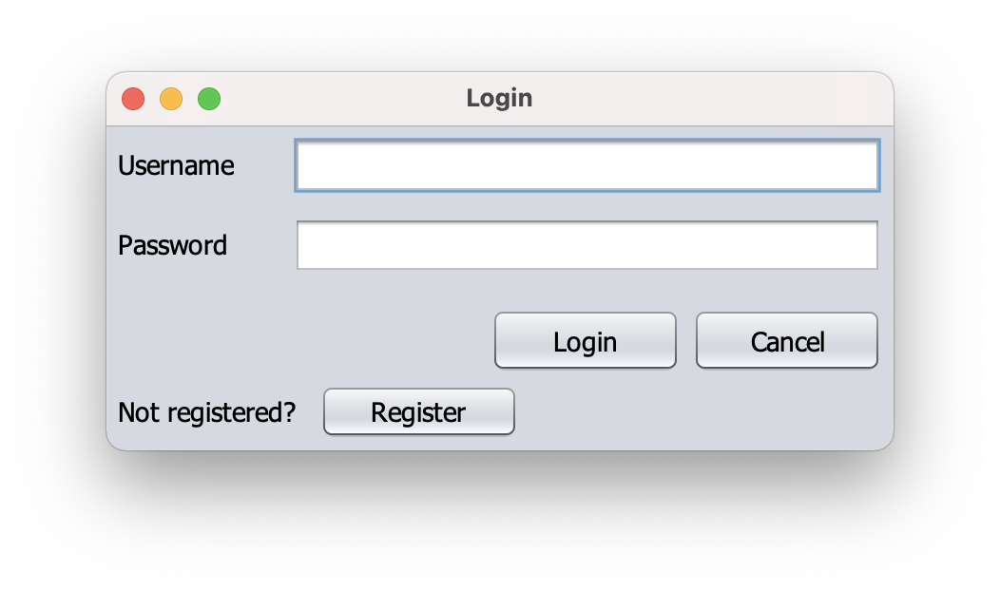
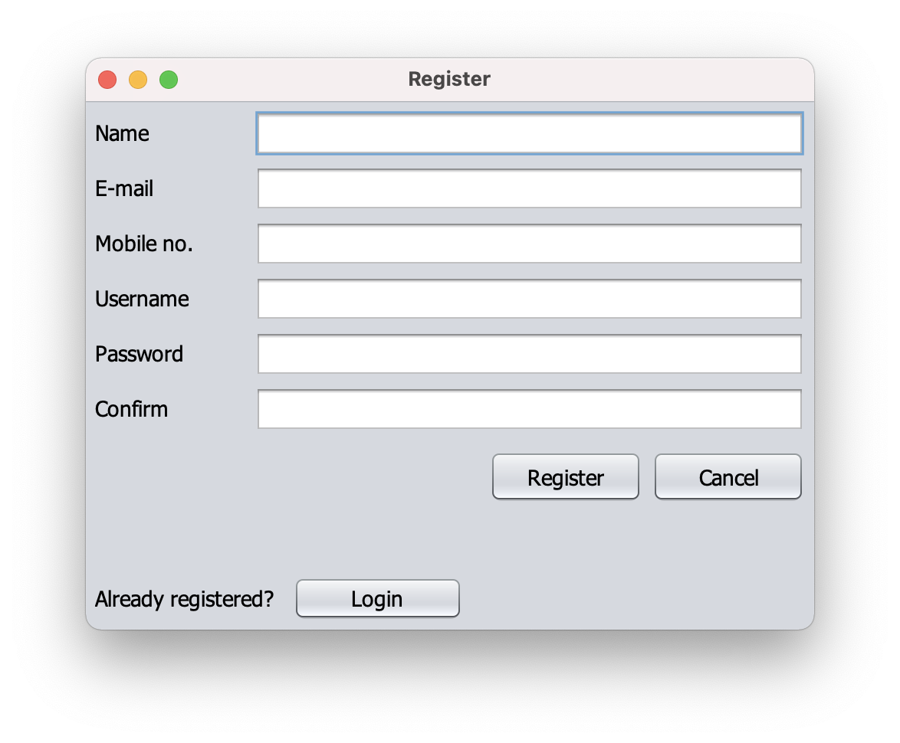
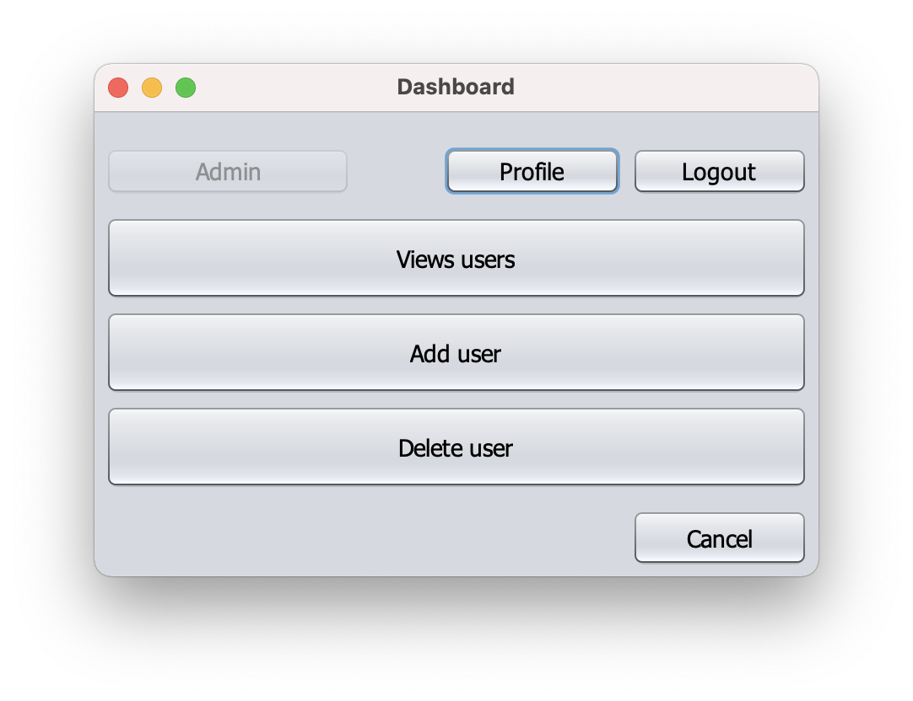
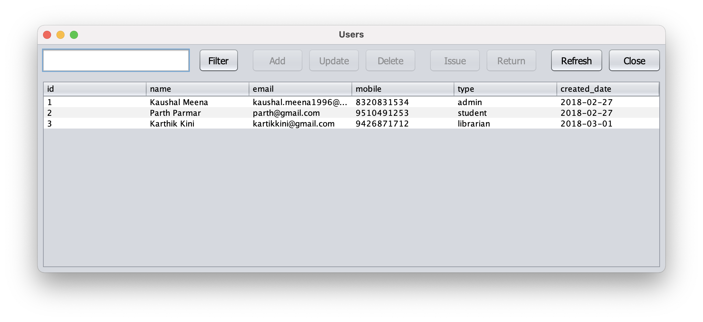
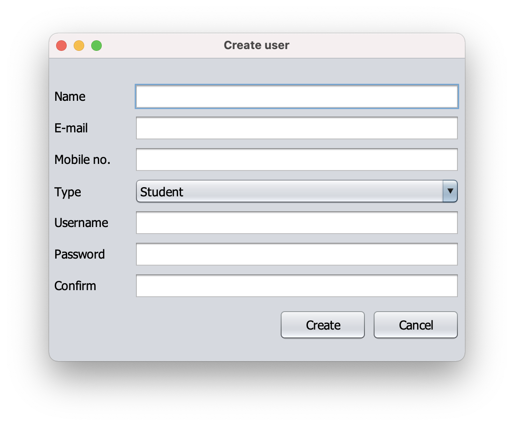
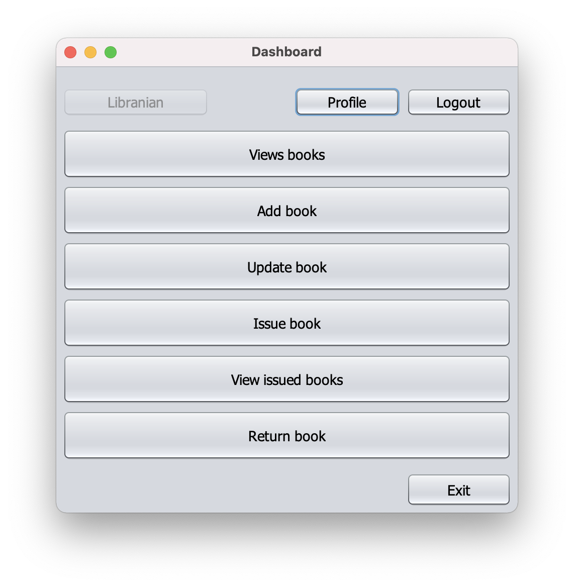
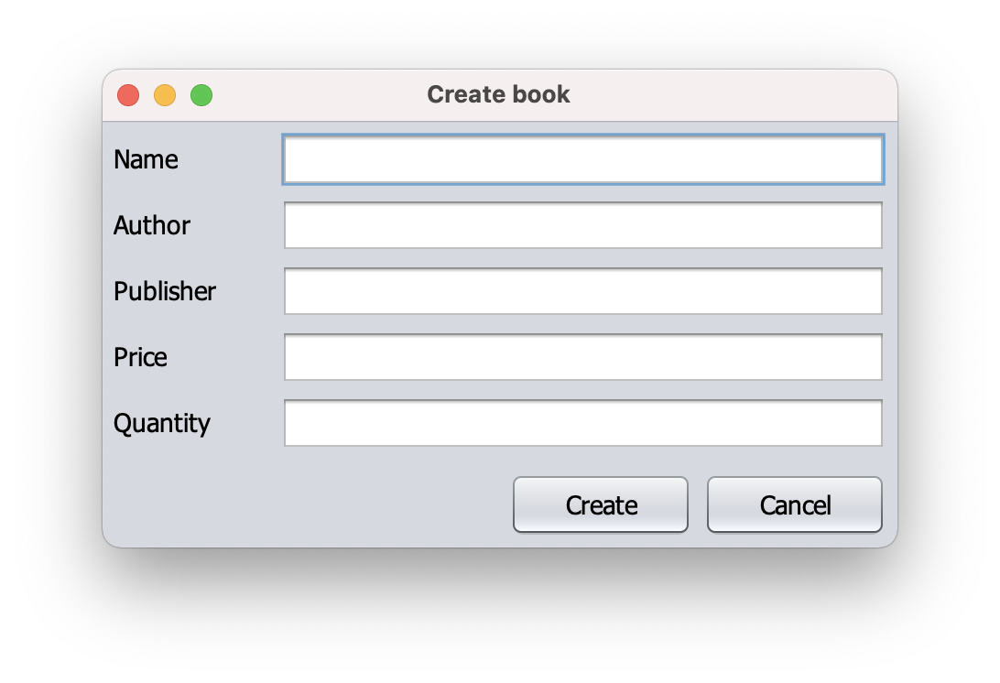
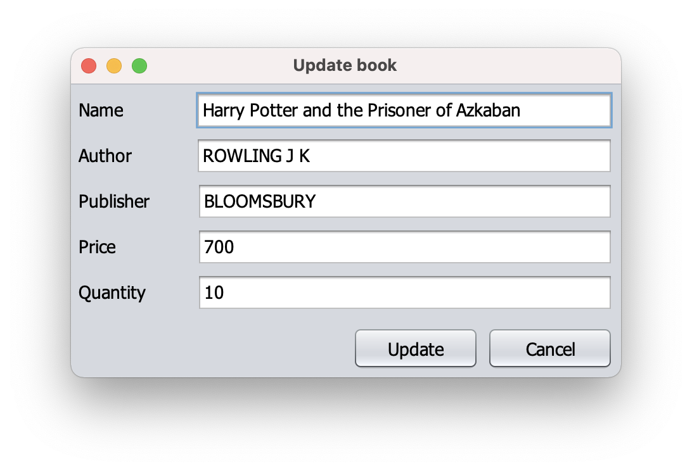
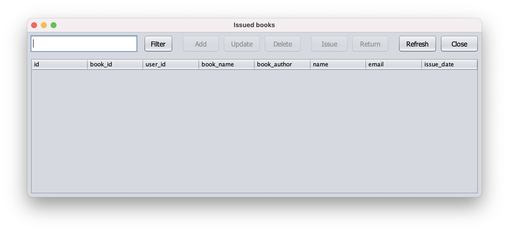

# Library Manager

A Netbeans project of Java application for library management system which stores data in SQLite database.

## Getting Started

These instructions will get you a copy of the project up and running on your local machine for development purposes.

### Prerequisites

To install this project you need:

- [Netbeans 12](https://netbeans.apache.org/download/nb120/nb120.html "Netbeans 12")
- [Java SE Development Kit 12](https://www.oracle.com/in/java/technologies/javase/jdk12-archive-downloads.html, "Java SE Development Kit 12")
- [git](https://git-scm.com/downloads "git") (only to clone this repository)

### Installation

To set up everything in your local machine, you need to follow these steps:

1. Clone this repo onto your computer:

```bash
$ git clone https://github.com/kaushalmeena/library-manager.git
```

2. Open Netbeans and click on File->Open project

3. Navigate to `library-manager` folder and press Open Project

## Screenshots

### Auth Module

 


### Admin Module


 


### Librarian Module


 

 


### Student Module


## License

This project is licensed under the MIT License - see the [LICENSE](LICENSE) file for details
